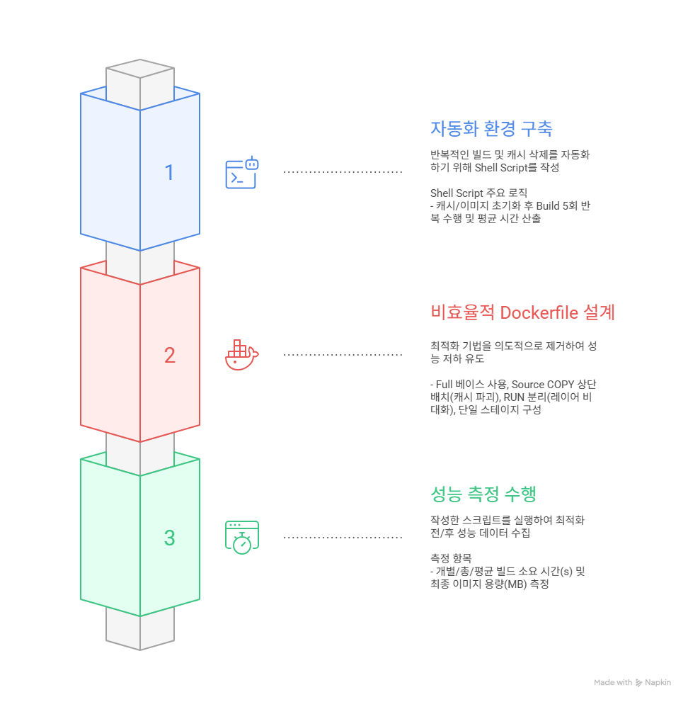
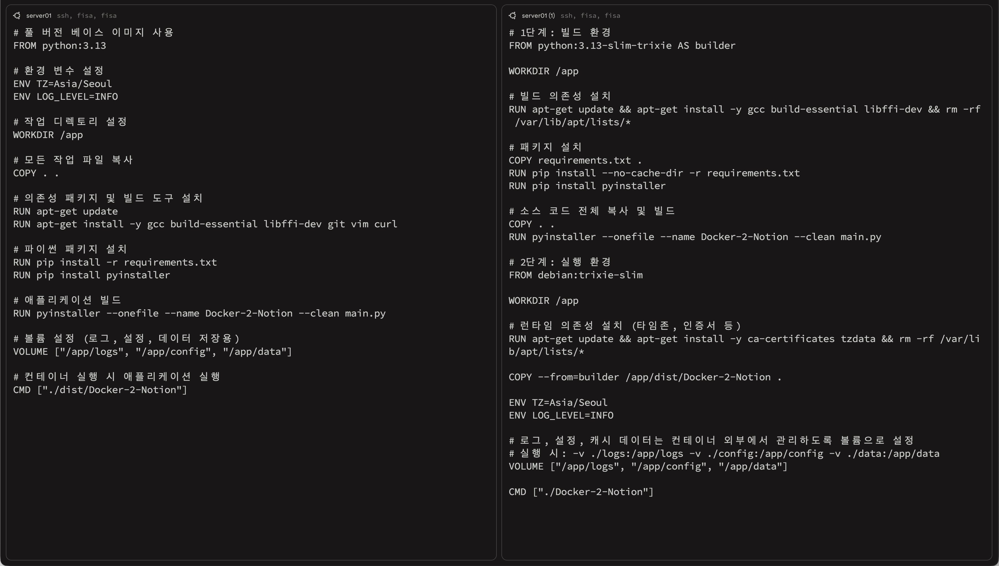
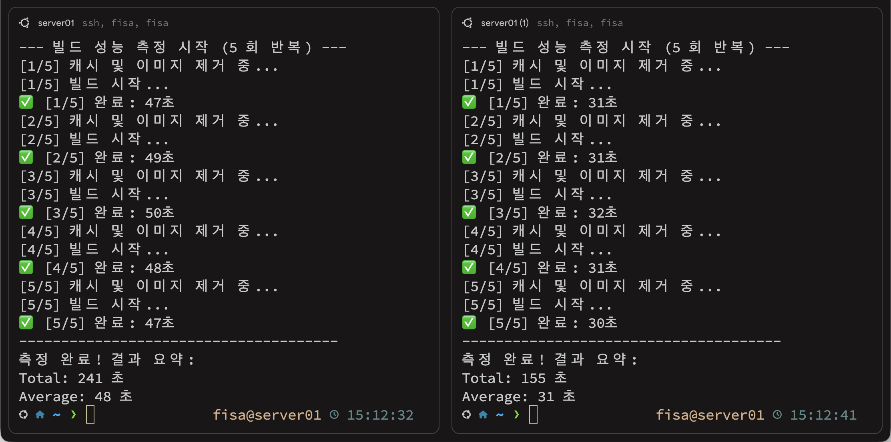

# Docker Image Optimization Lab

[1. 실습 방식](#1-실습-방식)

[2. 실습 수행 절차](#2-실습-수행-절차)

[3. Dockerfile 비교 및 성능 측정 결과](#3-Dockerfile-비교-및-성능-측정-결과)

[4. 최종 결과 비교 및 개선 효과 분석](#4-최종-결과-비교-및-개선-효과-분석)

[5. 최적화 필요성](#5-최적화-필요성)

[6. Dockerfile 작성 시 적용 원칙](#6-Dockerfile-작성-시-적용-원칙)

## 📃 프로젝트 개요

이미지 크기와 빌드 시간에 영향을 주는 안티 패턴을 의도적으로 적용해 보고, 최적화된 Dockerfile과의 성능 차이(용량 및 시간)를 정량적으로 비교 분석합니다.

💡 단순한 개선이 아니라 **비효율 → 원인 분석 → 최적화 → 결과 검증**의 흐름을 통해 Docker 레이어 구조와 캐싱 전략이 실제 성능에 미치는 영향을 확인하는 것을 목표로 합니다.

## 1. 실습 방식

Docker 이미지 최적화의 필요성을 검증하기 위해 의도적으로 Anti-pattern을 적용한 비효율적인 Dockerfile을 먼저 설계합니다

이후 동일한 Python 애플리케이션 [Docker-2-Notion (D2N)](https://github.com/Kumin-91/Docker-2-Notion)을 기준으로 다음 두 가지 환경을 구성합니다:

* **비효율적인 Dockerfile (Anti-pattern 적용) vs 최적화된 Dockerfile**

그 후 **빌드 시간과 이미지 용량을 반복 측정하여 평균값을 비교**합니다

## 2. 실습 수행 절차

## 3. Dockerfile 비교 및 성능 측정 결과

### 3.1 Dockerfile 비교

| 비효율적 Dockerfile vs 최적화된 Dockerfile |
| :---: |
|  |

### 3.2 빌드 시간 측정 및 이미지 용량 비교 결과

| 비효율적 Dockerfile 빌드 시간 측정 vs 최적화된 Dockerfile 빌드 시간 측정 |
| :---: |
|  |

### 3.3 이미지 용량 측정 결과

| 비효율적 Dockerfile 이미지 | 최적화된 Dockerfile 이미지 |
| :---: | :---: |
| `1,380 MB` | `101 MB` |

## 4. 최종 결과 비교 및 개선 효과 분석

| **항목** | **비효율적 Dockerfile** | **최적화된 Dockerfile** | **개선 효과** |
| :---: | :---: | :---: | :---: |
| **빌드 총 시간** | 241 초 | 155 초  | 약 36% 감소 |
| **평균 빌드 시간** | 48 초 | 31 초 | 약 35% 감소 |
| **이미지 크기** | 1,380 MB | 101 MB | 약 93% 감소 |

> **Dockerfile 최적화를 통해 이미지 용량과 빌드 시간이 모두 크게 개선되었으며, 특히 멀티 스테이지 빌드와 캐싱 전략이 성능 향상에 핵심 역할을 담당합니다.**

## 5. 최적화 필요성

* **비용 및 자원 절감:** 이미지 용량 감소로 스토리지 비용 절감 및 네트워크 전송 시간을 단축합니다.

* **보안 강화:** 멀티 스테이지 빌드를 통해 최종 실행 이미지에서 불필요한 빌드 도구를 제거함으로써 공격 표면을 최소화합니다.

* **개발 생산성 향상:** 효율적인 레이어 캐싱으로 코드 수정 후 빌드 시간을 단축합니다.

## 6. Dockerfile 작성 시 적용 원칙

> 성능 비교 실습을 통해 도출된 Dockerfile 빌드 최적화 전략

1. **멀티 스테이지 빌드:** 빌드 환경과 실행 환경을 명확히 분리하여 최종 이미지 크기를 최소화합니다.

2. **경량 베이스 이미지:** slim이나 alpine 같은 경량 이미지를 우선 사용합니다.

3. **레이어 캐싱 최적화:** 변경이 적은 파일부터 복사하고 자주 변경되는 소스 코드는 마지막에 배치합니다.

4. **레이어 수 감소:** 관련 RUN 명령어를 `&&`로 연결하여 불필요한 중간 레이어를 제거합니다.

5. **임시 파일 정리:** 빌드 과정의 apt 캐시, 패키지 매니저 캐시 등을 해당 레이어에서 즉시 삭제합니다.